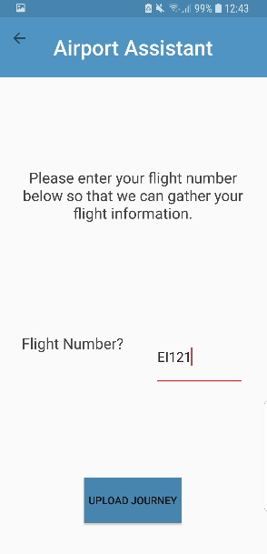

# Blog: Airport Assistant App

**Shauna Moran**

## Blog 1 - 15/10/2018
#### Selecting a project idea

After much deliberation I have finally settled on a project idea. I hope to develop an android application to help people who are stressed by airports get through the experience. I came up with this idea as I myself get nervous in airports. The main feature of my project will utilise AR to detect whether a hand luggage bag is the correct dimensions for the user’s airline. I think this will be the toughest element of the project but I’m looking forward to learning more about it. I have asked Ray Walshe to be my supervisor and he has helped me nail down a final idea over the last number of days. I have submitted my project proposal and am now further investigating my project idea and preparing my proposal presentation.

## Blog 2 - 23/10/2018
#### Preparing for Project Proposal Presentations

I am currently preparing for my project proposal presentation which is tomorrow at 3pm. We have to prepare a 5 minute presentation and will be asked questions following this. I hope my project is approved so that I can get working on my Functional Specification and get into the building of my application.

## Blog 3 - 24/10/2018
#### Project approved

My Project Proposal presentation was today at 3pm. A group of five of us students presented our project ideas for Martin Crane and Charlie Daly. They seemed to like my project idea but expressed their worries that I was taking on a lot of work as my project has a lot of moving parts which must be integrated.

My project was approved with the feedback "Airport Assistant Good idea Issues: - Lot of moving parts (user interface design is key to ensure consistent usability) - Have sth to demo (Bag dimensions with ARSUite could be tough but have a fall-back: standard size)" Thankfully the project was approved but I will take this feedback onboard to assist me with my project in the future.

## Blog 4 - 09/11/2018
#### Meeting with Ray

Today I met with Ray for a supervisor meeting. He had a number of questions about my project and advice. He asked me to figure out what data is obtained from QR codes on boarding passes? To investigate if I will need to obtain Ethical Approval for my project. Draw UI Diagrams to help give myself a better idea of how my application will work. Investigate using Google Calendar and Google Drive to add features to my application and consider using the measuring algorithm to measure liquids.

I also wanted to ask him about using Firebase as a database and he agreed that as I am using a large amount of Google Software, progressing with Firebase made sense. He had read over my Functional Specification which I had emailed him earlier that day and liked it's standard. I uploaded my first draft of my Functional Specification to git today. I just have some minor changes to make before it is completed.

## Blog 5 - 23/11/2018
#### Update on Project Progress

We have a had a large amount of work for our semester one modules to complete so my project work has been hard to keep up with project work. I have investigated the some of topics which Ray had queries about and must arrange a meeting for next week. I have found out what data is taken from the QR codes on the boarding passes using the Google Pay API for Passes.

I also emailed a member of the school ethics committee to ask if I need to obtain Ethical Approval for my project. They said I do indeed need to due to the fact that I will be holding passenger data. I've also made some small changes to my Functional Specification which is now due on the 30th of November due to an extension.

## Blog 6 - 28/10/2018
#### Meeting 2 with Ray

I met with Ray today and we discussed the progress I had made since our last meeting. I informed him taht I wasn't too happy with the progress I had made as I had a lot of assignments at the moment and had not been able to a lot the time I had wished to my project. Ray understood this but recommended that I try to find some time over the next few months to get the bones of my project built that I could develop further at a later time and take some of the pressure off second semester.

 Ray read my Ethical Approval form and signed it which I, immediately after our meeting, scanned and sent off to the School's Ethical Approval committee. Hopefully this will be approved soon.

 As I mentioned earlier, I had completed research on elements of my project which Ray had asked me to look into. We talked about this research and took note of how it will affect future project work.

Overall, Ray was satisfied with my progress and we arranged to try and meet mid- January before semester 2 starts.

## Blog 7 - 03/12/2018
#### Functional Specification Submitted and UI Started

I was delighted that I got the time to spend most of the past weekend working on my project as I had made significant progress with my other assignments. After my meeting with Ray where he advised I get a prototype up and running by mid January which I can then further develop throughout the semester, I decided to begin developing the UI of my application.

Using my previously drawn UI diagrams I determined that at this moment my application will have 23 screens but this could change as I progress through the project. I created 23 java and 23 xml files this weekend and designed the skeleton UIs for 12 of my screens, these include login, home, check-in, security and duty free. I also added a progress bar to all 23 pages.

Functional Specifications were due last Friday and I had it submitted and read over a number of times before this. I am happy with my Functional Spec and am delighted I have made further progress on the project.

## Blog 8 - 14/12/2018
#### Project Progress and Exam Study Period
Unfortunately my project has not received the attention I would have like it to over the last few weeks. I made more progress on my UI any free time but due to the vast number of assignments which we were due at the end of the semester, I have not had an awful lot of that.

Over the next number of weeks, I will try to take some time out of exam study to continue progress on my project to have myself in a good position for the beginning of next semester. My primary goal, as decided by myself and Ray, will be to have a MVP completed for mid-January with my Google APIs set up.

## Blog 9 - 22/01/2019
#### Post Exam Update
Exams went really well but I will need to dedicate more time to my project during the week off to ensure I am at the stage I would like to be before the beginning of semester 2. I have completed a small bit more work on my UI but have not began working on my APIs yet.

Unfortunately I never got a chance to organise a meeting with Ray as I was very busy studying for my exams. I will meet with him during the first week of semester 2 after I have completed some more work on the project.

## Blog 10 - 31/01/2019
#### Busy week off and first week of Semester 2
I am delighted with the progress I have made on my project over the last two weeks. I have the core of my UI set up and all of the buttons are functioning. I have also been working on my Google APIs and have my login set up alongside my Firebase database.

I have also been working on my Google Maps API and nearly have the basic maps functionality working, I just have a few small issues to iron out. From my research of the topic I have learned that I will have to implement a number of Google Maps APIs to achieve the functionality I want in my project. These include the Distance, Directions and Roads APIs. My goal is to work on this functionality in the next number of days.

Unfortunately, I discovered an issue with Google Pay for Passes API. I was under the impression that the API worked in a similar method to the standard Google Pay API but unfortunately it does not. This API is only for the use of airlines such as Ryanair to allow their customers to save their boarding passes to the Google Pay for Passes API and will not allow me to save boarding passes to my application.

This issue will mean that I am not able to display boarding passes in my application and will have come up with another way of taking in the flight information of a user. I am currently planning on asking a user their flight number, which applies to a flight from the same airline at a specific time regardless of day, and what day they are flying. This will involve web scraping. I will look into this during the next week after I get Ray's opinion of the idea.

## Blog 11 - 01/02/2019
#### Meeting 3 with Ray

I met with Ray this morning at 11am to discuss my project. We discussed my progress to date which Ray was happy with. I asked him about my issue with the Google Pay for Passes API. We agreed that web scraping will be the best approach to tackle this issue.

I asked Ray his opinion on when I should begin developing the AR functionality of my application as during my project. During my project proposal presentations Martin Crane had recommended that I leave this functionality to the end as it is best to have a working application that I can demo before I add in what will take it to the next level. Ray agreed with this advice and said I should work on the other functionality first.

We discussed how I could integrate the AR functionality into other aspects of my application. I will look into using the AR to project information about where a user is if they hold up their camera as they pass through the airport.

Ray also recommended that I look into using the Ordance survey API as it might provide more detail from within the airport that may not be available on the Google Maps API. Between now and the next meeting I will working on the Maps functionality, my Ethical Approval documentation and the web scraping functionality.

## Blog 12 - 08/02/2019
#### Weekly Update

This week there was positives and negatives for the Airport Assistant App. Great progress was made on the user interface of the application with back button functionality being added and the user interface itself being restructured. Unfortunately, a setback this week was attempting to get the Google Map APIs working together. I made great progress with the beginning of developing the map functionality and quickly got the map set up and a users location being requested and then shown on the application.

After this functionality I moved onto integrating the Directions API into the project. I am having trouble implementing this. It is difficult to debug as it is not throwing an error. I have noticed that the API is returning no routes and this is therefore resulting in a null pointer which throws an exception.

Instead of getting bogged down with this error, I am going to move on and look at adding read and write functionality to my database. I am also looking into web scraping functionality and will return to the maps functionality on Monday with a fresh pair of eyes.

While researching my maps functionality and how much of this will be necessary in my project, I have decided that I will also implement the Google Places API in the duty free and arrivals sections of my application. This will allow users to see what is around them that they may be interested in as they pass through these two areas.

I met with Ray briefly today to get my ethical approval documentation signed. I completed this documentation throughout the week and this morning uploaded it to my git for approval.

## Blog 13 - 15/02/2019
#### Weekly Update

A good amount of progress was made in developing my application this week considering that week 3 brought about assignment work from two of my other modules and results day.

The focus of this week was...
* writing and reading to and from the Firebase Database
* web scraping
* creating warning messages when a user hasn't filled in a field
* use case testing
* completing some pages such as the Security screen

As I began use case testing this week I discovered a number of bugs throughout the application. I stepped through the application and tried clicking different options on each page. This resulted in the discovery of a number of bugs including the application crashing if a user didn't input certain fields. To resolve these issues I prevented the user from not entering these fields and popped up a message to alert them that certain fields had to be entered. An example of this can be seen here...

  

The main web scraping functionality implemented this week was that users could input their flight number and I then scraped the Dublin Airport website to get the flight time, destination and airline. The user later confirms their journey and then moves onto progressing through the journey.

*Enter Flight Number*           | *Scraped Flight Information*
:---------------------------------:|:-------------------------------------:
 |

All of this data is written to the Firebase Database where it can later be read from. This can be seen here....

Unfortunately, I did not get to work on the Maps functionality this week. I will be working on this over the next week and will hopefully make significant progress despite being busy with other assignments at the moment. I will also be working on other web scraping functionality.

## Blog 14 - 21/02/2019
#### Ethical Approval Granted

This morning I received an email to inform me that my Ethical Approval submission had been approved.  

I was delighted to have this completed as once I reach the user testing phase of my project I will need such approval. It is great to have this done early so that I can return to focussing on the developing and testing of my project.

## Blog 15 - 22/02/2019
#### Weekly Update

I am very happy with the progress I have made this week. The biggest headway made this week was with the Google Maps functionality. I decided to face into the issue I was facing first thing on Monday morning and thankfully, I resolved it. It turned out that it was a simple issue with the API key which was easy to fix but difficult to discover. Once this was corrected my application now returned directions for a user's chosen method of transport. This can be seen here...

*Driving*           | *Public Transport*         |  *Cycling*         | *Walking*        
:---------------------------------:|:---------------------------------:|:---------------------------------:|:-------------------------------------:
 || |

Once I had this completed I started to organise myself to establish where I am in terms of my project. Thankfully, I have been keeping a journal of my project where I am consistently keeping track of what I have completed and what I have yet to do. I also track changes in the project and bugs I discover which I must return to. On Monday I am some small things to resolve to have the ability to mark pages as "Complete". Although these pages are not perfect, they are at a standard that can be further enhanced later if I have time. I must be conscious of the time constraint on these project and manage my time appropriately. As you can see, at this time I have "Completed" eight of the pages of my application. The majority of my remaining functionality is down to the Maps functionality, some minor fixes and of course AR. I am excited to tackle AR but have to ensure that I have an application I am confident with before I add on what is, in my opinion, the WOW factor.

As the map functionality for each of these sections is completely different, I have to spend some time working on the set up of each page. This was what the majority of this week doing. At the moment I have the Maps API, Current Location API and Directions API working on one of these pages, Transport to Airport, and am working on getting this working in Duty Free, Directions to Gate and Arrivals Directions. Once each of these are working I will progress onto adding the Distance Matrix API to all of these pages (as it gives the travel distance and time) and the Places API (which gives local points of interest) to the Duty Free and Arrivals pages. If I have time I will also implement the Roads API (gives information such as speed limits) to the Transport to Airport and Arrivals pages if I have the time.

I also have a number of minor bug fixes and issues to work on over the next week. Finally, I will email Ray this week to organise a meeting.

## Blog 16 - 28/02/2019
#### Meeting 4 with Ray

I met with Ray this morning at 11:15 to discuss the progress of my project. I was proud of the work I had gotten through in the last 4 weeks so was excited to see what he would think of my progress. We discussed my progress and what I plan to complete in the next number of weeks. Ray mentioned that I should outline goals for the AR functionality I wish to add to the application.

 We discussed that I firstly hope to achieve the functionality to measure hand luggage using my application. As the ARCore SDK is currently released in Beta only, this may be a difficult task to achieve. It was for this reason that I implemented the rest of the applications core functionality first so that I could dedicate a vast amount of time to this functionality.

 If I am successful at achieving this functionality and still have some time remaining, I hope to adapt this functionality to possibly measure the containers of liquids which will be passing through security. This could possibly be achieved by getting the area of a container and calculating its rough measurement of millilitres. This would allow the application to warn users if there container is over a certain size.

 I could also possibly explore the possibility of having the AR functionality used with the Google Maps functionality to give directions. I will have to look into the ARCore SDK to see if this functionality is feasible.

 Below is a snippet from my project journal which displays the progress I have made in my project since my last meeting and my goals I wish to accomplish before my next one.

## Blog 17 - 01/03/2019
#### Weekly Update

A vast amount of functionality has been added over the last week. This includes adding the ability for users to input their destination when they arrive at the destination airport. The application then provides the user with directions to this location. As you can see in the screenshots below, these directions are given from Heathrow Airport. Ideally, I would use the users current location and direct from there, but as this would not be possible to demo in this project, I have implemented it in this manner. Similarly to directions to the airport, the user can select their desired mode of transport.

*Arrivals Input*           | *Arrivals Zoom In*         |  *Arrivals Zoom Out*                
:---------------------------------:|:---------------------------------:|:---------------------------------:|
 ||

Secondly, I implemented the directions to gate functionality. As Dublin Airport to not openly provide gate information outside of the airport, users will have to manually input their gate number. They are instructured to check the departure board for their flight. Airport App displays the users flight information to aid in this process. Once the user inputs this gate number they are directed to this gate. In the screenshots below it can be seen that unfortunately this is not currently directing users exactly to their gate. This appears to be due to the number of floors in the airport. We can see that the application is directing the user to an elevator to access their gate's floor. I will have to look into this issue further and will hopefully be able to resolve it. The time taken to get to the gate is so long in this current example as the user is walkiing to their gate and the below screenshot is directing the user from Dublin Airport.

*Gate Number Input*           | *Gate Directions Zoom In*         |  *Gate Directions Zoom Out*                
:---------------------------------:|:---------------------------------:|:---------------------------------:|
 ||

Users are also now presented with the time and the distance it will take to get to the user's goal. This can be seen for each of the four modes of transport below.

*Driving*           | *Public Transport*         |  *Cycling*         | *Walking*        
:---------------------------------:|:---------------------------------:|:---------------------------------:|:-------------------------------------:
 || |

Finally, the places api has been added to the Duty Free screen. This allows users to see what is around them in terms of shops, bars, cafes and other services. This can be seen in the example below.

